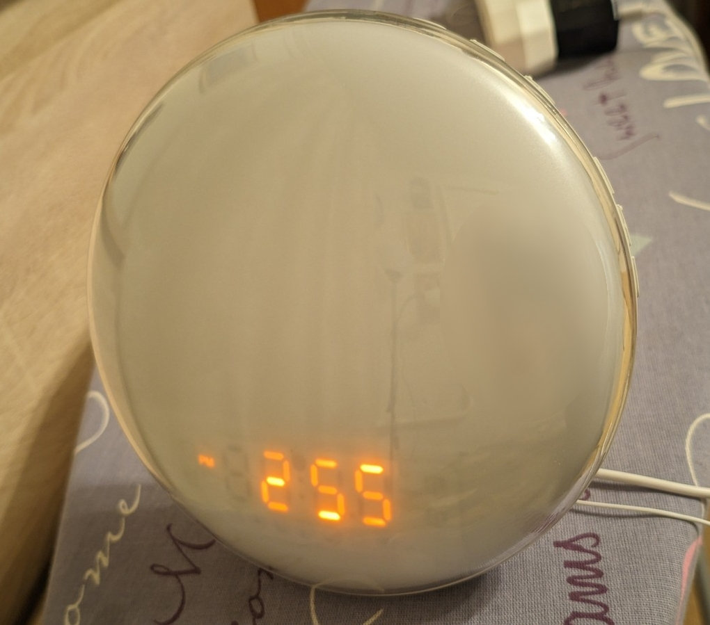
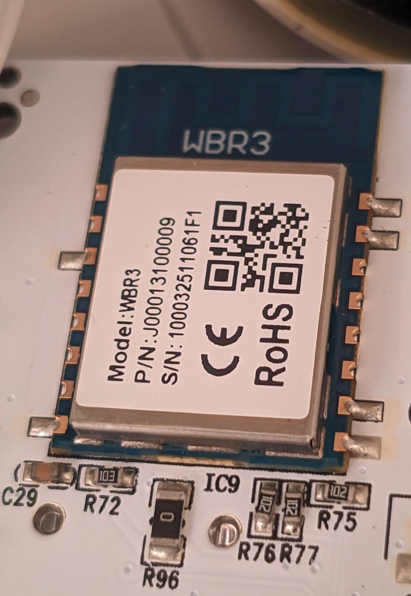
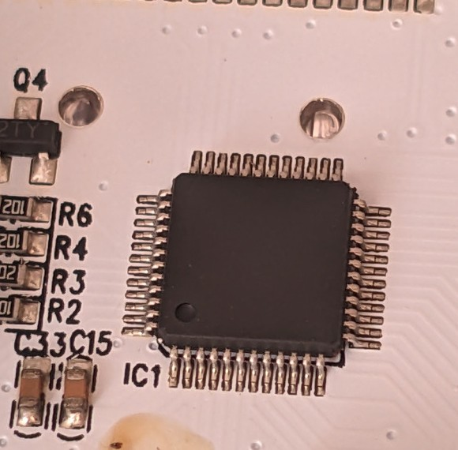
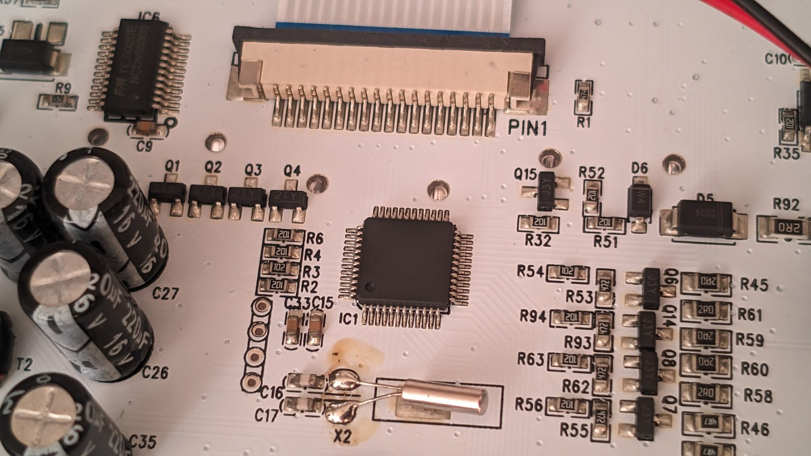
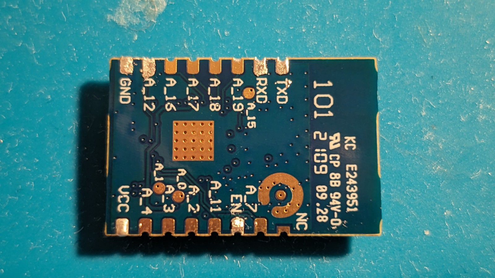

# Wake Up Light II (Tuya WBR3 / RTL8720CF) → ESPHome

Local, cloud-free ESPHome firmware and reverse-engineering notes for a **Wake Up Light II** sunrise alarm clock using a **Tuya WBR3** Wi-Fi module and a separate appliance MCU.

This work was reverse-engineered from a real unit by sniffing the original Tuya MCU UART, dumping the startup handshake, mapping datapoints one function at a time, desoldering/programming the WBR3, and fixing ESPHome's WBR3 alternate-UART pin routing.

> **Status:** usable. Main lamp, brightness, clock display mode, FM power/volume, both alarm enables/times, Alarm 1 sound/volume/wake-light/sunrise duration, sunset mode, ambient-light power, 12/24 h mode, local web UI, OTA, manual clock setting, and optional SNTP time sync are implemented. Several raw structures remain partially decoded.



## Identified device

The stock MCU product-information reply is:

```text
55 aa 03 01 ...
{"p":"ya39qahrcdhvxowz","v":"6.0.2","m":0}
```

So the identifiers found on this unit are:

| Item | Value |
|---|---|
| Product name | Wake Up Light II |
| Tuya PID | `ya39qahrcdhvxowz` |
| Appliance-MCU firmware string | `6.0.2` |
| Wi-Fi module | Tuya `WBR3` |
| Wireless SoC / LibreTiny target | Realtek `RTL8720CF`, AmebaZ2 |
| ESPHome board | `wbr3` |
| Main-MCU protocol | TuyaMCU serial protocol |
| Main-MCU UART | 9600 baud, 8 data bits, no parity, 1 stop bit |
| WBR3 MCU-UART pins | PA13 = RX0, PA14 = TX0 |
| Flash layout | Tuya RTL8720CF layout, 2 × 896 KiB OTA application slots |

The current `tuya-local` device definition contains **this exact PID** and identifies it as **Wake Up Light II / ACA002-II-WWA**:

- Source: <https://github.com/make-all/tuya-local/blob/main/custom_components/tuya_local/devices/moes_zcjk_alarmclock.yaml>
- `tuya-local` project: <https://github.com/make-all/tuya-local>

That file is useful as a second source for the datapoint map, but it appears to be a **superset** of the physical unit tested here. In particular it defines Alarm 3/4 datapoints, while this lamp's physical interface and indications expose **two alarms**. This repository therefore does not assume DP123/124 are usable.

## The two controllers

### 1. Tuya WBR3 — Wi-Fi / ESPHome MCU



The WBR3 is the module being replaced with ESPHome firmware. LibreTiny identifies it as a Realtek RTL8720CF/AmebaZ2 target.

| Specification | Value |
|---|---|
| CPU | ARM Cortex-M33 / KM4 class |
| Clock | 100 MHz |
| SRAM | 256 KiB |
| Flash | 2 MiB |
| Supply | 3.0–3.6 V |
| Wi-Fi | 802.11 b/g/n, 2.4 GHz |
| LibreTiny board | `wbr3` |
| Programming UART | UART2: PA15/RX2, PA16/TX2 |
| Lamp communication UART | UART0: PA13/RX0, PA14/TX0 |

References:

- LibreTiny WBR3 board page: <https://docs.libretiny.eu/boards/wbr3/>
- LibreTiny RTL8720CF/AmebaZ2 flashing guide: <https://docs.libretiny.eu/docs/platform/realtek-ambz2/>
- Tuya WBR3 datasheet: <https://developer.tuya.com/en/docs/iot/wbr3-module-datasheet?id=K9dujs2k5nriy>

### 2. Main appliance MCU — IC1



What is known experimentally:

- It controls the lamp's local appliance logic: display/buttons, alarms, light modes and radio-facing state.
- It communicates with the WBR3 using the Tuya MCU serial protocol at **9600 8N1**.
- It reports product PID `ya39qahrcdhvxowz` and MCU firmware string `6.0.2` in the Tuya product-info response.
- The original device continues to operate locally when the WBR3 firmware is replaced, because ESPHome talks to this MCU instead of directly driving all lamp hardware.




## Stock Tuya UART handshake

The original WBR3 sends the standard Tuya handshake to the appliance MCU. Examples captured from this unit:

```text
WBR3 -> MCU
55 aa 00 00 00 00 ff                 heartbeat
55 aa 00 01 00 00 00                 product-info request
55 aa 00 02 00 00 01                 working-mode request
55 aa 00 03 00 01 00 03              Wi-Fi state report

MCU -> WBR3
55 aa 03 00 00 01 01 04              heartbeat reply
55 aa 03 01 00 2a ...                 product-info reply
```

The product payload decodes to:

```json
{"p":"ya39qahrcdhvxowz","v":"6.0.2","m":0}
```

## Datapoint map

“Confirmed” means directly observed on the physical unit. “Exact PID definition” means present in the `tuya-local` profile for `ya39qahrcdhvxowz`, but not necessarily verified on this exact hardware revision.

| DP | Tuya type | Meaning | Status / notes |
|---:|---|---|---|
| 101 | bool | Main/dusk light power | **Confirmed** |
| 102 | integer | Main light brightness | **Confirmed**, range 10–1000. Observed steps: 10, 60, 110, 160, 210, 270, 320, 370, 420, 470, 530, 580, 630, 680, 730, 790, 840, 890, 940, 1000 |
| 103 | string | Clock time | **Confirmed**, `HHMMSS`, e.g. `173700` = 17:37:00; writable |
| 104 | integer | Clock/display brightness mode | **Confirmed** 0=off, 1=day/on, 3=auto; exact-PID definition also gives 2=night |
| 105 | bool | FM radio power | **Confirmed** |
| 106 | integer | Radio volume | **Confirmed**, 1–16 |
| 107 | raw/base64 | FM station/preset data | **Confirmed present**, encoding not decoded; examples `14:02`, `14:04`, `14:05`, `14:06` |
| 109 | bool | Alarm 1 enable | **Confirmed** |
| 116 | integer | Snooze duration | Exact PID definition only, 8–15 min |
| 117 | string | Snooze action | Exact PID definition only |
| 121 | bool | Sunset / sleep-aid mode | **Confirmed** |
| 122 | bool | Alarm 2 enable | **Confirmed** |
| 123 | bool | Alarm 3 | Exact PID definition only; **not exposed by this physical unit** |
| 124 | bool | Alarm 4 | Exact PID definition only; **not exposed by this physical unit** |
| 125 | bool | Network-time setting | Exact PID definition only |
| 126 | bool/button | Radio seek/stop | Exact PID definition only |
| 127 | raw | Alarm configuration structure | **Confirmed and partially decoded**, see below |
| 128 | raw | Sunset/sleep configuration | **Confirmed**, partially decoded only |
| 129 | bool | Ambient/color-light power | **Confirmed**; exact PID definition agrees |
| 130 | bool | Snooze | Exact PID definition only |
| 131 | bool | 12/24-hour mode | **Confirmed**, false/off=12 h, true/on=24 h |
| 132 | string | Ambient color/effect | Exact PID definition; exposed read-only in YAML until verified |

The exact-PID `tuya-local` profile maps DP132 color strings to white/red/orange/yellow/lime/cyan/blue/magenta and also uses the same DP for an effect field. Treat that as reference information until this hardware revision is tested directly.

## DP127 alarm structure

DP127 is 16 bytes on this unit. The safest implementation is to **cache the MCU-provided packet and modify only decoded bytes**.

| Byte(s) | Meaning | Confidence |
|---|---|---|
| 0 | Alarm 1 enable | confirmed |
| 1–2 | Alarm 1 time, big-endian minutes since midnight | confirmed |
| 3 | Alarm 1 weekday mask | confirmed field; bit-to-weekday order not decoded; `0x7F` = all days observed |
| 4 | Unknown; `0x1E` commonly observed | unknown |
| 5 | Alarm 1 wake-light enable | confirmed, 0/1 |
| 6 | Alarm 1 sound | confirmed: 1–7 built-in, 8=FM; family manual documents 0=no sound |
| 7 | Alarm 1 volume | confirmed, 1–16 |
| 8 | Unknown; `0x04` commonly observed | unknown |
| 9 | Sunrise lead/duration in minutes | confirmed; 10 and 20 observed; family manual says 10–60 min |
| 10 | Wake-light brightness | confirmed, 0–20; 0=off |
| 11 | Unknown | unknown |
| 12 | Alarm 2 enable | confirmed |
| 13–14 | Alarm 2 time, big-endian minutes since midnight | confirmed |
| 15 | Alarm 2 weekday mask | confirmed field; bit order not decoded |

Time encoding examples:

```text
14:00 = 840 minutes = 0x0348 -> 03:48
15:00 = 900 minutes = 0x0384 -> 03:84
15:01 = 901 minutes = 0x0385 -> 03:85
```

Measured Alarm 1 packets include:

```text
01:03:48:7F:1E:00:01:01:04:0A:00:00:00:03:48:7F
# A1 14:00, sound 1

01:03:85:7F:1E:01:02:02:04:14:0A:00:00:03:48:7F
# A1 15:01, sound 2, volume 2, wake light 10/20, sunrise 20 min
```

An important finding: changing **Alarm 2 sound, volume, wake-light brightness and sunrise time did not change DP127**. Only Alarm 2 enable/time/day fields are confirmed here. Do not assume the Alarm 1 middle block is shared with Alarm 2.

## DP128 sunset/sleep structure

DP128 is confirmed to carry sleep/sunset settings, but its full byte map is still TODO. Two captured examples are:

```text
01:01:01:0A:0A:04:0A:0C:0A:01
01:01:02:08:14:04:14:14:14:01
```

The physical family manual describes sleep-aid duration, light brightness, sleep sound/radio and volume. More one-setting-at-a-time captures are needed before making DP128 writable.

## Why an ESPHome UART patch is required

The lamp uses **UART0 on WBR3 PA13/PA14**. LibreTiny documents PA13=RX0 and PA14=TX0, but ESPHome's LibreTiny UART component has historically selected only one board-default pin pair for each hardware UART. With stock code the Tuya component transmitted in software logs but received no replies and repeatedly failed at:

```text
Initialization failed at init_state 0
```

Relevant upstream references:

- ESPHome issue #13596: <https://github.com/esphome/esphome/issues/13596>
- Closed PR #13629 (“libretiny uart now allows more than one set of pins per uart”): <https://github.com/esphome/esphome/pull/13629>

The PR moved toward LibreTiny's `setPins()` API but was not merged. The targeted workaround used here does two things:

1. Accepts `(TX=PA14, RX=PA13)` as hardware UART0.
2. Calls `Serial0.setPins(rx_pin, tx_pin)` before the normal two-argument `begin()`.

> This is a **UART patch, not an I²C patch**.

Patch files in this repository:

- [`patches/wbr3-pa13-pa14-uart.patch`](patches/wbr3-pa13-pa14-uart.patch)
- [`patches/apply_uart_patch.py`](patches/apply_uart_patch.py)

The patch file is written against the 2026.9-era ESPHome source layout. The helper script fails instead of patching blindly if the source shape changes.

### Apply the patch to a pip/Conda ESPHome install

Activate the same Python environment that runs `esphome`, then:

```bash
python3 patches/apply_uart_patch.py
esphome clean wake-up-light-ii.yaml
esphome compile wake-up-light-ii.yaml
```

A successful patched boot should log:

```text
Using alternate UART0 pins RX=PA13 TX=PA14
```

ESPHome upgrades can overwrite the patched source file, so re-check after every upgrade. If upstream issue #13596 is fixed, remove the local patch rather than stacking it on top.

## WBR3 wired programming — official LibreTiny wiring and order



Do not use the normal appliance UART (PA13/PA14) for ROM flashing. **RTL8720CF is flashed through UART2.** The following connections and sequence come from the LibreTiny WBR3/AmebaZ2 documentation.

### Connections

| PC / supply | WBR3 |
|---|---|
| USB-UART **TX** | **PA15 / RX2** |
| USB-UART **RX** | **PA16 / TX2** |
| USB-UART GND | GND |
| Stable regulated **3.3 V** | VCC |
| **3.3 V** boot strap | **PA00** |
| Leave floating or 3.3 V | **PA13**; do **not** pull it to GND |
| Brief reset to GND | **CEN** |

PA00 is on the underside of WBR3, so LibreTiny notes that the module normally needs to be **desoldered** for UART flashing.

### Official download-mode order

LibreTiny's documented sequence is:

1. Connect the USB-UART adapter.
2. Connect **PA00 to 3.3 V**.
3. Power-cycle the module **or** briefly short **CEN to GND** and release it.
4. Start the flashing process.

If a serial terminal is open at the time, successful boot into ROM download mode may print:

```text
Open Download Mode on UART
```

Authoritative references:

- WBR3 quick flashing guide: <https://docs.libretiny.eu/boards/wbr3/#quick-flashing-guide>
- RTL8720CF/AmebaZ2 flashing guide: <https://docs.libretiny.eu/docs/platform/realtek-ambz2/#flashing>

## Backup, compile and flash

Install tools (preferably in a venv/Conda environment):

```bash
python3 -m pip install -U esphome ltchiptool
```

### 1. Back up the stock WBR3 flash first

Enter download mode using the sequence above, then:

```bash
ltchiptool list families
ltchiptool flash read ambz2 wake-up-light-stock.bin -d /dev/ttyUSB0
sha256sum wake-up-light-stock.bin
ls -lh wake-up-light-stock.bin
```

WBR3 has 2 MiB flash, so preserve that dump somewhere safe.

### 2. Apply the UART patch and compile

```bash
python3 patches/apply_uart_patch.py
esphome clean wake-up-light-ii.yaml
esphome compile wake-up-light-ii.yaml
```

Find the generated UF2:

```bash
find .esphome/build/wake-up-light-ii -name firmware.uf2 -type f -print
```

You can ask `ltchiptool` to identify it before writing:

```bash
ltchiptool flash file \
  .esphome/build/wake-up-light-ii/.pioenvs/wake-up-light-ii/firmware.uf2
```

### 3. Write ESPHome over UART2

Re-enter download mode and flash:

```bash
ltchiptool flash write \
  .esphome/build/wake-up-light-ii/.pioenvs/wake-up-light-ii/firmware.uf2 \
  -d /dev/ttyUSB0
```

`ltchiptool` documentation recommends the generated LibreTiny `.uf2` and auto-detects the correct file type/offsets:
<https://docs.libretiny.eu/docs/flashing/tools/ltchiptool/>

### 4. Re-solder WBR3 and use OTA afterwards

The supplied YAML creates a permanent standalone AP by default:

```text
SSID: Wake-Up-Light-II
IP:   192.168.4.1
Web:  http://192.168.4.1/
```

There is intentionally **no `captive_portal:`** in the final YAML. With a captive portal enabled, the user can be dropped into the Wi-Fi provisioning/OTA page instead of the normal ESPHome control UI. `web_server.local: true` embeds the web assets so the control page works without Internet access.

Native ESPHome OTA:

```bash
esphome upload wake-up-light-ii.yaml --device 192.168.4.1
```

Web-server OTA if explicitly needed:

```bash
esphome upload wake-up-light-ii.yaml \
  --device 192.168.4.1 \
  --ota-platform web_server
```

## ESPHome configuration

The current self-contained configuration is:

- [`wake-up-light-ii.yaml`](wake-up-light-ii.yaml)

It includes:

- WBR3 / RTL8720CF board definition.
- Patched UART0 on PA13/PA14 at 9600 8N1.
- TuyaMCU integration.
- Main light DP101/102.
- Writable lamp clock DP103.
- Clock display mode DP104.
- FM power DP105 and volume DP106.
- Alarm 1/2 enable and writable times.
- Writable Alarm 1 sound, volume, wake-light brightness and sunrise duration while preserving unknown DP127 bytes.
- Sunset/sleep power DP121.
- Ambient-light power DP129.
- 12/24 h mode DP131.
- Read-only diagnostics for DP107/127/128/132.
- Manual clock setting from the local web UI.
- Optional SNTP synchronization when the device has upstream network access.
- Permanent offline AP + local web server.
- Native ESPHome OTA + web-server OTA.

### Time sync note

The lamp can be used entirely offline. In standalone AP-only mode there is no route to public NTP servers, so use the **Lamp Clock** time control in the web UI. If you uncomment station Wi-Fi in the YAML, SNTP can update ESPHome's time and the firmware writes the current `HHMMSS` string back to DP103. The `tuya.time_id` integration is also enabled for standard Tuya time queries.

## Flash/RAM headroom observed

A working build during development reported approximately:

```text
IRAM symbols: ~52 bytes
RAM:   5.1%  (13,369 / 262,144 bytes)
Flash: 62.2% (570,973 / 917,504 bytes)
```

So there is substantial headroom for additional local features, while still leaving sensible OTA/application margin.

## Related family manual

A Dekala/Moes-style Wake Up Light II family manual is useful for understanding the physical feature ranges (alarm sounds, volume 1–16, wake-light brightness 0–20, sunrise 10–60 minutes, sleep aid, FM 87.5–108 MHz):

<https://device.report/m/a5d28aca7037b8e58e776419b04c3402ced77f285a16ca3fce887c406d7b0bd2.pdf>

That manual is for a related model/revision, so use it as behavioral reference rather than proof of identical electronics.

## TODO / worthwhile additions

For this lamp, the most worthwhile additions are:

- **Finish DP127 decoding:** weekday-bit order and unknown bytes 4, 8 and 11.
- **Find Alarm 2 extended settings:** sound, volume, wake-light level and sunrise duration are stored somewhere other than the DP127 middle block on this unit.
- **Fully decode DP128:** make sunset/sleep duration, brightness, sound/radio choice and volume writable.
- **Decode DP107:** turn the raw FM payload into actual frequency/preset information and add previous/next/scan controls; verify DP126.
- **Ambient/color lamp control:** verify DP132 on this revision and expose color/effect controls rather than only DP129 power.
- **Snooze:** verify DP116/117/130 from the exact-PID definition and expose them safely.
- **Better local web UI:** move to Web Server v3 and group Light / Clock / Alarm 1 / Alarm 2 / Radio / Sunset / Diagnostics.
- **Fully autonomous schedules:** add software-only extra alarms or weekday schedules without depending on Tuya cloud/app limits.
- **Better clock correction:** configurable local NTP server, LAN-only synchronization, and optional drift measurement/correction.
- **Astronomical sunrise/sunset:** use ESPHome's local sun calculations for real dusk/dawn behavior.
- **Home Assistant native API:** optional `api:` support while retaining the standalone web UI.
- **Diagnostics:** Wi-Fi RSSI, uptime, reboot reason, ESPHome/LibreTiny version, Tuya-link state and raw-packet viewer.
- **Identify IC1:** obtain a board with readable top marking or otherwise identify the main appliance MCU.
- **Upstream the UART fix:** replace the local PA13/PA14 workaround when ESPHome gains proper LibreTiny alternate-UART pin mapping.

## Safety / recovery notes

- Make a full stock flash dump before writing custom firmware.
- WBR3 is a **3.3 V** device; do not power it from 5 V.
- Use common ground between the module supply and USB-UART adapter.
- Do not pull PA13 to GND when entering RTL8720CF download mode.

## Credits / references

Made with help of ChatGPT. This reverse-engineering work builds on ESPHome, LibreTiny, ltchiptool, Tuya's public module documentation, and the community `tuya-local` device definition.

- ESPHome: <https://esphome.io/>
- ESPHome Tuya MCU component: <https://esphome.io/components/tuya/>
- ESPHome Web Server: <https://esphome.io/components/web_server/>
- LibreTiny WBR3: <https://docs.libretiny.eu/boards/wbr3/>
- LibreTiny AmebaZ2: <https://docs.libretiny.eu/docs/platform/realtek-ambz2/>
- ltchiptool: <https://docs.libretiny.eu/docs/flashing/tools/ltchiptool/>
- Tuya WBR3 datasheet: <https://developer.tuya.com/en/docs/iot/wbr3-module-datasheet?id=K9dujs2k5nriy>
- `tuya-local` exact-PID definition: <https://github.com/make-all/tuya-local/blob/main/custom_components/tuya_local/devices/moes_zcjk_alarmclock.yaml>
- ESPHome issue #13596: <https://github.com/esphome/esphome/issues/13596>
- ESPHome PR #13629: <https://github.com/esphome/esphome/pull/13629>
